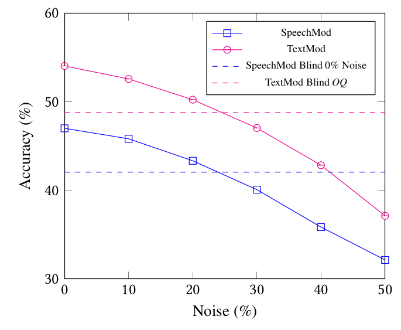

# Speech-Based Visual Question Answering <!-- .element: class="title" -->

2021.01.26  
Ke-Han Lu

https://arxiv.org/abs/1705.00464 <!-- .element: class="footnote" -->

---

## Outline

- Task
- Model
  - TextMod
  - SpeechMod
- Experiment
  - Noise
  - Zero-Shot
  - Human-recorded
- Discussion
- Future work

---

## Task

**VQA**
- Question✏️ + Image🖼️ ➝ Answer✏️

**Speech-based VQA**
- Question🔉 + Image🖼️ ➝ Answer✏️
- Vision + Text + Speech + (Reasoning)

- Speech-based VQA can be used to **assist blind people** in performing ordinary tasks, and to
dictate robotics in real visual scenes in a **hand-free manner** such as
clinical robotic surgery

----

## Examples

 <!-- .element: class="img100" -->

----

## This work

- Investigates the potential of integrating vision and speech in the context of VQA

**2 methods**
- End-to-end: audio ➝ answer
  - Useful for languages that have less text-speech data.
- ASR: audio ➝ ASR ➝ Text-based method ➝ answer

----

## Main contributions

- Introduce an End-to-end model
- Inspect the performance impact of having different levels of noise
- Release a dataset: 200 hour synthetic and  1 hour real speech data.

---

## Model

  <!-- .element: class="img75" -->

----

## Language: TextMod

- Input: one-hot encodings
- Learned embedding layer
- LSTM + Dense

 <!-- .element: class="img25" -->

----

## Language: SpeechMod

- Input: raw waveform
- series of 1D convolutions (reduce dimensionality)
- LSTM + Dense

 <!-- .element: class="img25" -->

----

## Vision

- Input: Image(4096)
- Last layer of VGG19
- Dense
- Merge: using element-wise multiplication
- Dense output ➝ Probability distribution over N classes

----

## The architectures (WHY?)

- **Simplicity and similarity**
- Establish a baseline model for SVQA
- TextMod is similar to the baseline of VQA($\text{VQA1.0}$). SpeechMod also uses minimal components.
- TextMod and SpeechMod differ from each other as little as possible (for comparison)

---

## Experiment <!-- .element: class="section-title" -->

----

## Data

- VQA 1.0
- Amazon Polly API: generate audio file for each question
  - All same voice
- Mix with different level of noise

$$
W_{\text{corrupted}} = (1-NL) * W_{\text{original}} + NL * W_{\text{noise}}
$$

- Real data: 1000 questions
  - $\frac{1}{3}$ male, $\frac{2}{3}$ female

----

## ASR

- Kaldi (DNN-HMM)

----

## Experiment (Blind)
- TextMod: train and evaluate on OQ
- SpeechMod: train and evaluate on 0% noise

 <!-- .element: class="img50" -->

----

## Experiment (TextMod)
TextMod: trained on **original question**
- best performing model is used to evaluate based on transcribed text
- ASR: used 0-50% noise

 <!-- .element: class="img50" -->

----

## Experiment (SpeechMod)
SpeechMod: trained on 0% noise
- evaluate on 10~50% noise

 <!-- .element: class="img50" -->

----

## Experiment.
 <!-- .element: class="img100" -->

----

## Observation

- SpeechMod doesn't perform better
  - TextMod is 7% better than SpeechMod at 0% noise
- Compare to Blind models
  - Y/N Bias from dataset (the question is understood => good chance of answering correct answer)
  - Tells how many question are understood
  - Blind is better than 0% noise
  - Image + noise audio is less informative than Blind

----

## Zero-Shot
- Questions never seen in training
- $\text{ZS}$ is subset of $\text{val}$ set
- Trained on $\text{train}$, test on $\text{ZS}$
  - No test set because of no partial ground truth

----

## Human Recordings

- 1000 sample from $\text{val}$
- best model from $\text{ZS}$ were used for evaluation

 <!-- .element: class="img75" -->

---

## Discussion <!-- .element: class="section-title" -->

----

## Discussion

- (modality) Speech contains more information than text
  - best performing model must be that which extract **patterns most effectively**
- TextMod: relies on ASR
  - ASR is more complicated than entire SpeechMod
  - ASR serve to filter out noise (a feature extractor, intermediate standardization of data)
- SpeechMod:  audio data only
  - the model may not extract the concept of words from audio (future research)
  - data standardization is helpful for unseen data

----

## Discussion.

(In Zero-Shot section)
- TextMod still better than SpeechMod
  - TextMod: can glimpse from word meaning
  - SpeechMod: new words is entirely different signal!
    - continuous streams

(In human-recorded section)

- human-recorded audio has inflections, emphasis, accents, and pauses...

----

## Discussion...

It is evident in our experiments that text-based VQA performs
better than speech-based, but **bearing in mind the simple architecture and limited amount of training data**, we believe the results of SpeechMod merits further study into end-to-end methods

---

## Future work

- Improve end-to-end model by data augmentation
- add feature extractors, attention mechanisms, GAN training...
- enforce prediction of question while learning to answer the question

- restrict the amount of training data to both approaches
  - compare learning efficiency
  - minor languages
