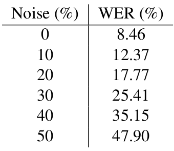
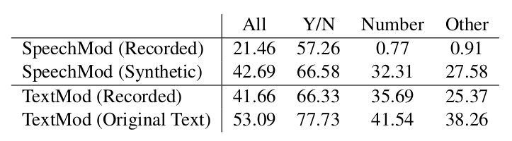

# Speech-Based Visual Question Answering <!-- .element: class="title" -->

2021.02.02  
Ke-Han Lu

https://arxiv.org/abs/1705.00464 <!-- .element: class="footnote" -->

---

## Outline

- Task and Dataset
- Model
  - TextMod
  - SpeechMod
- Experiment
  - Noise
  - Zero-Shot
  - Human-recorded
- Discussion
- Future work

---

## Task

**VQA**
- Question✏️ + Image🖼️ ➝ Answer✏️

**Speech-based VQA**
- Question🔉 + Image🖼️ ➝ Answer✏️
- Vision + Text + Speech

 <!-- .element: class="img100" -->

----

## Dataset (VQA)

https://visualqa.org/ <!-- .element: class="footnote" -->

- VQA 1.0: 2015~2017
- VQA 2.0: 2017~present

$\text{VQA 1.0}$

| Dataset       | Questions | Images | Answer      |
|---------------|-----------|--------|-------------|
| Train         | 248349    | 82783  | Available   |
| Val           | 121512    | 40504  | Available   |
| Test-dev      | 60864     | 81434  | Server only |
| Test-standard | 244302    | 81434  | Server only |

----

## Dataset (SpeechVQA1.0)

- Based on $\text{VQA 1.0}$
- Amazon Polly API: generate audio for each question
  - 200 hours synthetic audio
- 1000 human-recorded questions (not released)

https://competitions.codalab.org/competitions/6961 <!-- .element: class="footnote" -->

---

## Model

  <!-- .element: class="img75" -->

----

## SpeechMod (CNN)

 <!-- .element: class="img100" -->

---

## Experiment <!-- .element: class="section-title" -->

----

## Data

- SpeechVQA 1.0
- Mix with different level of noise

$$
W_{\text{corrupted}} = (1-NL) * W_{\text{original}} + NL * W_{\text{noise}}
$$

- Real data: 1000 questions
  - $\frac{1}{3}$ male, $\frac{2}{3}$ female

----

## ASR

- Kaldi (DNN-HMM)

----

## Experiment

 <!-- .element: class="img50" -->

Baseline: LSTM Q+I (from $\text{VQA1.0}$)<!-- .element: class="footnote" -->

----

## Experiment (Blind)
- TextMod: train and evaluate on OQ
- SpeechMod: train and evaluate on 0% noise

 <!-- .element: class="img50" -->

----

## Zero-Shot
- Questions never seen in training
- $\text{ZS}$ is subset of $\text{val}$ set
- Trained on $\text{train}$, test on $\text{ZS}$
  - No test set because of no partial ground truth

----

## Human Recordings

- 1000 sample from $\text{val}$
- best model from $\text{ZS}$ were used for evaluation

 <!-- .element: class="img75" -->

---

## Discussion <!-- .element: class="section-title" -->

----

## Discussion

- (modality) Speech contains more information than text
  - best performing model must be that which extract **patterns most effectively**
- TextMod: relies on ASR
  - ASR is more complicated than entire SpeechMod
  - ASR serve to filter out noise (a feature extractor, intermediate standardization of data)
- SpeechMod:  audio data only
  - the model may not extract the concept of words from audio (future research)
  - data standardization is helpful for unseen data

----

## Discussion.

(In Zero-Shot section)
- TextMod: can glimpse from word meaning
- SpeechMod: new words is entirely different signal!
  - continuous streams

(In human-recorded section)

- human-recorded audio has inflections, emphasis, accents, and pauses...

---

## Future work

- Improve end-to-end model by data augmentation
- add feature extractors, attention mechanisms, GAN training...
- enforce prediction of question while learning to answer the question
- restrict the amount of training data to both approaches
  - compare learning efficiency
  - minor languages
