# Speech and BERT <!-- .element: class="title" -->

2021.01.15  
盧克函 游照臨 吳苡瑄

---

# An Audio-enriched BERT-based Framework for Spoken Multiple-choice Question Answering <!-- .element: class="title" -->
## Chia-Chih Kuo, Shang-Bao Luo, Kuan-Yu Chen <!-- .element: class="subtitle" -->

---

## Outline

- Task(SMCQA)
- Methodology
  - TSAtt
  - aeBERT
- Experimental Setup
- Experimental Results
- Conclusion

---

## Spoken Multiple-choice Question Answering

- Spoken MCQA

  - 1 Passage 🔊
  - 1 Question 🔊
  - Multiple choices 🔊

- Listening comprehension task

----

## Naïve Approaches

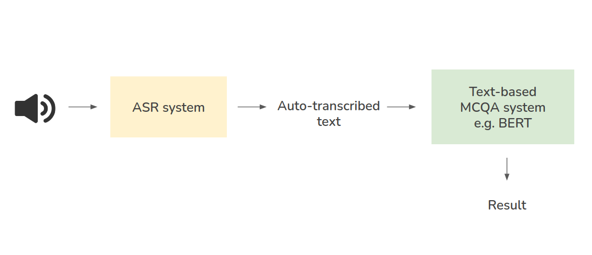

----

## Naïve Approaches.

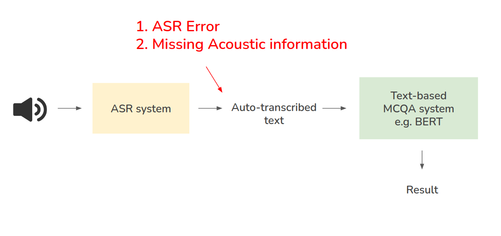

---

# Methodology <!-- .element: class="slide-center" -->

----

## Vanilla BERT

- Passage $p=\\{w_1^p, w_2^p,\cdots,w_{|p|}^p\\}$
- Question $q = \\{w_1^q, w_2^q,\cdots,w_{|q|}^q \\}$
- $n^{th}$ choice $c_n = \\{w_1^{c_n}, w_2^{c_n},\cdots,w_{|{c_n}|}^{c_n} \\}$
- Concatenation of token sequence
  - QCP

$$
\\{[CLS], q, c_n, [SEP], p, [SEP]\\}
$$

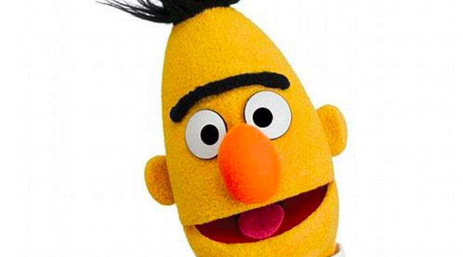 <!-- .element: class="img50" -->

----

## Audio-enriched BERT-based Framework
- aeBERT(Proposed)

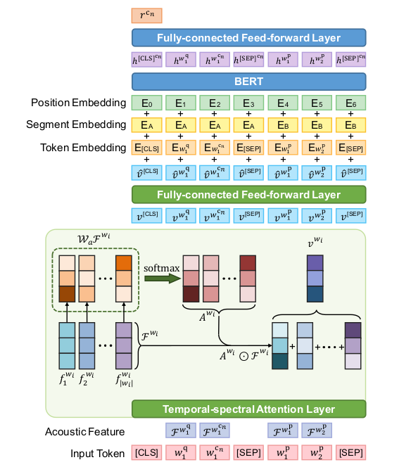

----

## Temporal-spectral Attention Layer

- For each auto-transcribed token $w_i$ and its corresponding acoustic feature vectors(MFCCs)

$$
\mathcal{F}^{w_i} = \\{f_1^{w_i}, \cdots, f_{|w_i|}\\} \in \mathbb{R}^{d_a \times |w_i|}
$$

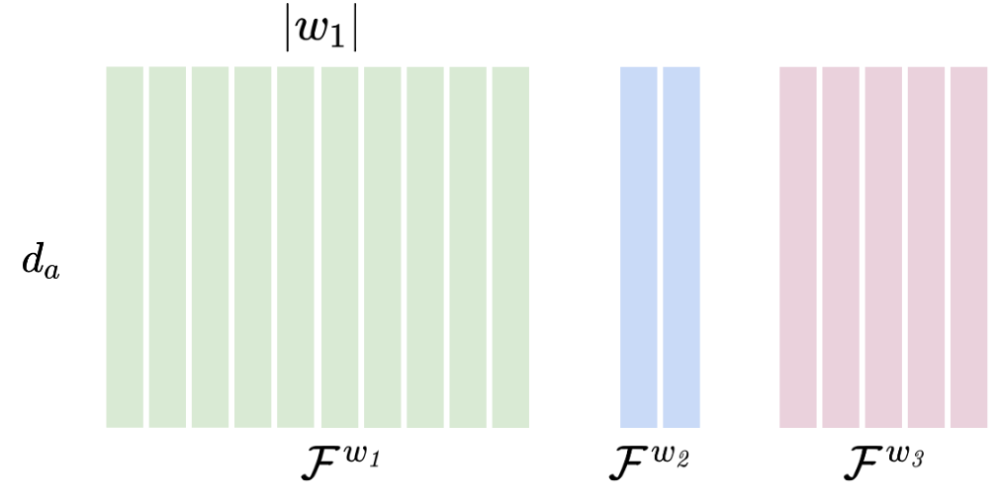

----

## MFCCs

- Front-end Signal Processing

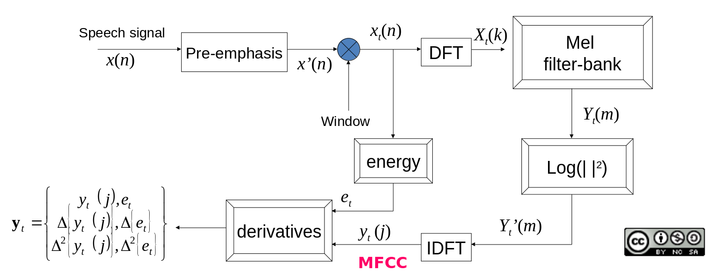

國立臺灣大學 李琳山教授 【數位語音處理概論】<!-- .element: class="footnote" -->

----

## MFCCs.

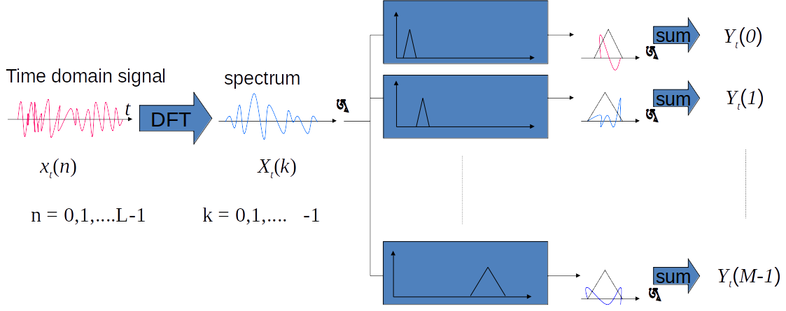

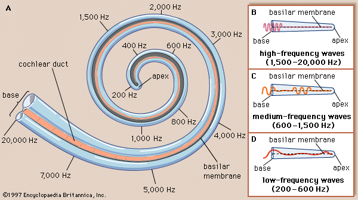

國立臺灣大學 李琳山教授 【數位語音處理概論】<!-- .element: class="footnote" -->

----

## MFCCs..

- Pre-emphasis
- Framing & window
- Short time FT
- Mel Filter-bank ➝ **F-bank**
- Inverse FT
- Derivatives
- ➝ **MFCC** (43)

----

## Temporal-spectral Attention Layer.

- Attention map

$$
A^{w_i} = \text{softmax}(\mathcal{W}_a\mathcal{F}^{w_i})
$$

$$
\mathcal{W}_a \in \mathbb{R}^{d_a \times d_a},
A^{w_i} \in \mathbb{R}^{d_a \times |w_i|}
$$

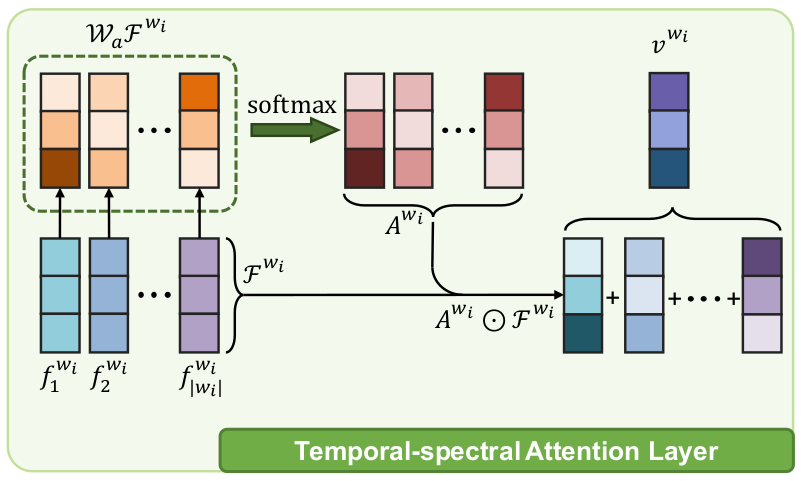

----

## Temporal-spectral Attention Layer..

- Acoustic level representation

$$
v^{w_i} = \sum^{|w_i|}_{j=1}\[ A^{w_i} \odot  \mathcal{F}^{w_i}\]
$$

----

## Temporal-spectral Attention Layer...

- Acoustic level representation with size $d_t$ 🤗

$$
\hat{v}^{w_i} = \mathcal{W}_sv^{w_i} + b_s
$$

$$
\hat{v}^{w_i} \in \mathbb{R}^{d_t}
$$

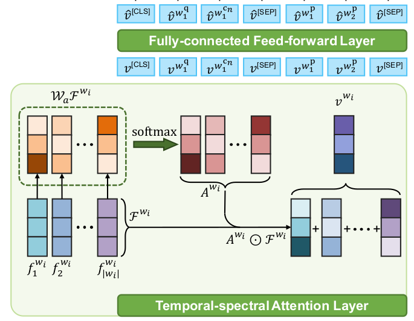

----

## aeBERT.

----

## aeBERT..

$$
r^{c_n} = \mathcal{W}_rh^{[CLS]^{c_n}} + b_r
$$

$$
P(c_n) = \frac{\exp (r^{c_n})}{\sum^N_{n^\prime=1}\exp (r^{c_{n^\prime}})}
$$

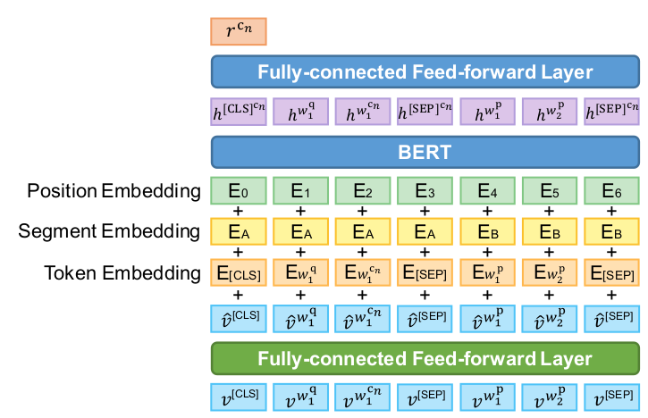

---

# Experimental Setup <!-- .element: class="slide-center" -->

----
## Experimental Setup

**Dataset**
  - 2018 Fromosa Grand Challenge
    - Dev set, test set, advanced test set
  - A passage, a question and 4 candidate choices
  - Including science, news, medicine, literature, history and so on.

**ASR system**
  - Kaldi
    - trained based on TDNN-F with lattice-free MMI
  - **Error rate 7.79%**

----

## Experimental Setup.

**BERT**

- Huggingface
- 1 epoch MSE warm up
  - Minimize MSE between acoustic-level representation ($v^{w_i}$) and token embeddings.
- Finetune aeBERT

---

# Experimental Results <!-- .element: class="slide-center" -->

----

## Vanilla BERT

w.r.t **manual transcriptions** and **auto-transcribed text**

- Upper bound

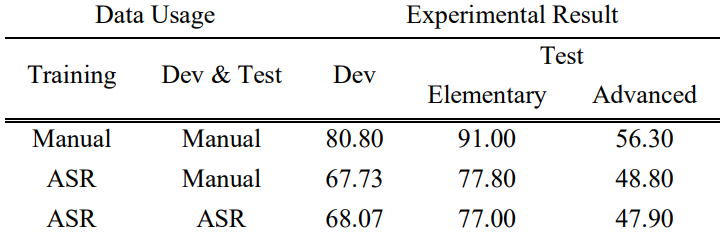

----

## Performance

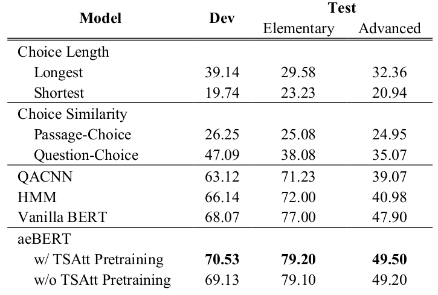

----

## Our Experiment

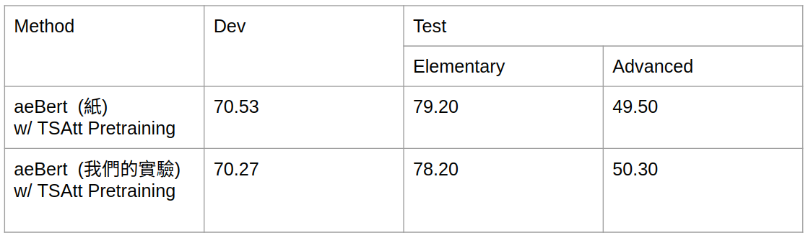

---

## Conclusion

**Audio-enriched BERT-based framework**
- Proposed framework showed remarkable superiority than other strong baselines, indicating the potential of the framework.
- TSAtt: temporal and spectra attention

**Future work**
- Evaluate the framework on other dataset.
- Extend the proposed aeBERT to other NLP-related tasks

----

## Our contribution from this presentation
*the reason you shoud give us full points! ;-)*

- We introduced the **MFCCs** and **F-bank** representations, which are everywhere in speech research field.
- We shared a novel method to use pretrained BERT for different task.

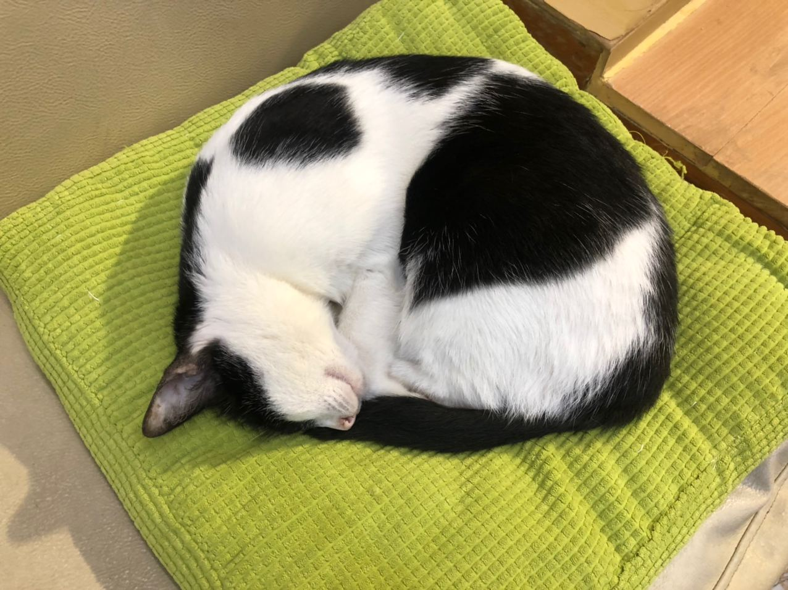
