---

title: 'VinVL: Making Visual Representations Matter
in Vision-Language Models'
event: 'Sinica meeting'
date: "2021-03-16"
theme: theme/mytheme.css

---

# VinVL: Making Visual Representations Matter in Vision-Language Models <!-- .element: class="title" -->
## Pengchuan Zhang et al., 2021 <!-- .element: class="subtitle" -->

2021.03.16  
Ke-Han Lu

----

## Outline

- Oscar: Object-Semantics Aligned Pre-training for Vision-Language Tasks (2020)
    - Vision language pre-train
- VinVL: Making Visual Representations Matter in Vision-Language Models (2021)
    - New object detector
    - Oscar+

---

## Vision-Language Pre-train(VLP)

1. An object detection model is pre-trained to encode the image to feature vectors.

$$
(q,v) = \text{Vision}(\text{Img})
$$

$$
q\text{: object tags},\space\space v\text{: region feature}
$$

2. A cross-modal fusion model is pre-trained to blend text and visual features.
    (e.g. Multi-layer transformers)

$$
y = \text{VL}(w, q, v)
$$
$$
w\text{ :word sequence}
$$
 

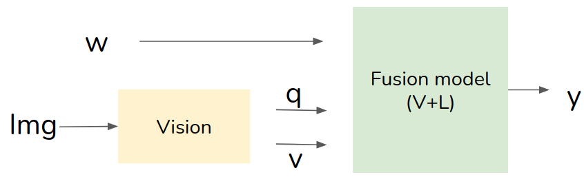

----

## VisualBERT (Liunian Harold Li et al., 2019)

- Image-text pairs (e.g. image captions)
- region features from object detector (e.g. **Faster R-CNN**)

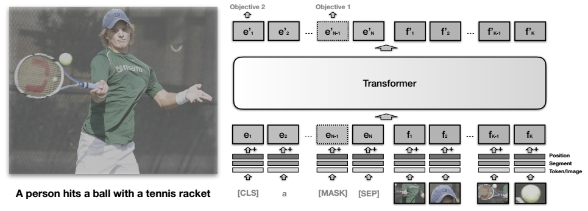 <!-- .element: class="img100" -->

----

## Problems of existing VLP model

- Visual regions are often over-sampled, noisy and ambiguous.
- Lack of explicit **alignment** information between image regions and text 

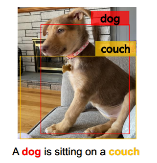

----

## Oscar (Xiujun Li et al., 2020)
- Training samples
  - word sequence
  - **object tags** (as anchor points)
  - image region feature
- Motivation
  - Salient objects in an image can be accurately detected.
  - These objects are often mentioned in the paired text.

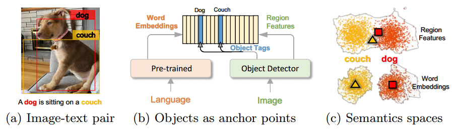 <!-- .element: class="img100" -->

----

## Oscar architecture

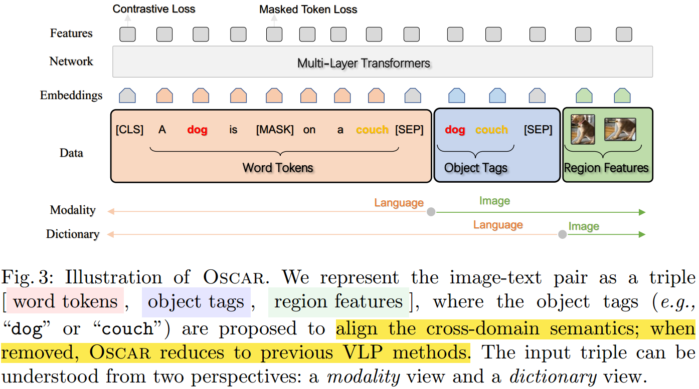 <!-- .element: class="img100" -->

----

**Dictionary View: Masked Token Loss**
- Randomly mask 15% of input token with `[MASK]`, predict from surroundings and image information.

$$
h \overset{\Delta}{=} [w, q]
$$

$$
\mathcal{L}_{\text{MTL}} = -\mathbb{E} _{(v,h)\sim \mathcal{D}} \log p (h_i | h _{\backslash i}, v)
$$

**Modality View: Contrastive Loss**
- Randomly replace 50% $q$ with different tag sequence sampled from the dataset.
- Use `[CLS]` to predict whether the pair contains original image representations($y=1$)
$$
h^\prime \overset{\Delta}{=} [q, v]
$$

$$
\mathcal{L}_{\text{C}} = -\mathbb{E} _{(h^\prime, w)\sim \mathcal{D}} \log p (y | f(h^\prime, w))
$$

----

## Oscar results

### Down-stream tasks
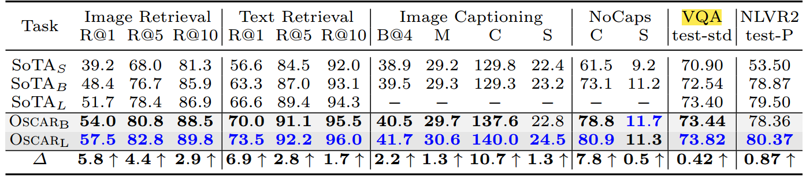 <!-- .element: class="img100" -->

### VQA

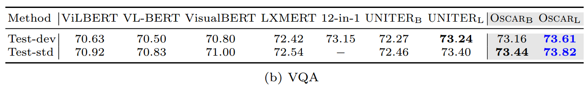 <!-- .element: class="img100" -->

Oscar(6.5M), VQA: LXMERT(9.18M) <!-- .element: class="footnote" -->

----

## t-SNE

- Intra-class: person
- Inter-class: animals

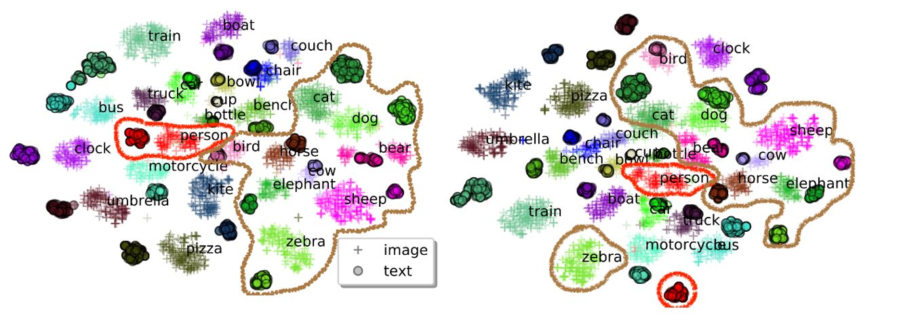 <!-- .element: class="img100" -->

left: Oscar, right: Baseline <!-- .element: class="small" -->

---

## VinVL (Pengchuan Zhang et al., 2021)

### Existing VLP research:

- Focuses mainly on improving the cross-modal fusion model
- Treat image understanding module as a black box.
    - since Anderson et al. (2018)

### This work:
- Improving object-centric visual representations and demonstrate that **visual features matter in VL models**.
- Uplift the SoTA results on all major VL tasks.
    - Oscar+

----
## Example
- Much richer semantics (visual concepts and attribute)
    - e.g. sky, mountain, water
- Detected bounding boxes cover nearly all semantically meaningful regions

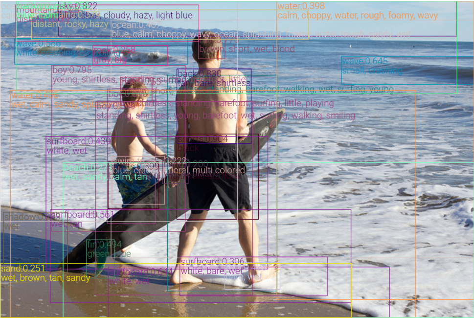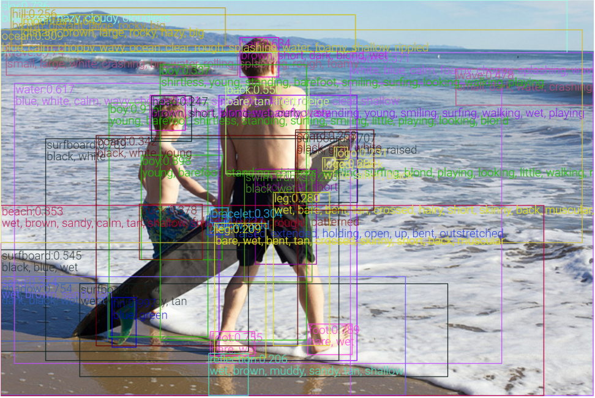

left: Anderson et al.(2018), right: VinVL <!-- .element: class="small" -->

----

## VinVL training

**Backbone:** X152-C4

**Data:**
- Pre-train:
    - 4 Datasets(VG, COCO, Object365, OpenImagesV5)
    - 2.49M Image
    - 1848 classes
- Fine-tuning
    - Visual Genome(attributes), 524 classes
    - Larger attributes loss

----

## Oscar+ Pre-train

### Corpus
5.65M images, 8.85M text-tags-image triplets

### Objectives

- **Masked Token Loss**

- **Contrastive Loss**
    - 50%: Matched triplets
    - 25%: {caption, image-tags, image-features} $(w^\prime, q, v)$ 
        - (Text-image retrieval)
    - 25%: {question, answer, image-features} $(w, q^\prime, v)$
        - (Visual QA)

Oscar: 4.1M unique images, 6.5M text-image pair <!-- .element: class="footnote" -->

----

## Oscar+

$$
\theta =  \\{ \theta_\text{BERT}, W \\}
$$

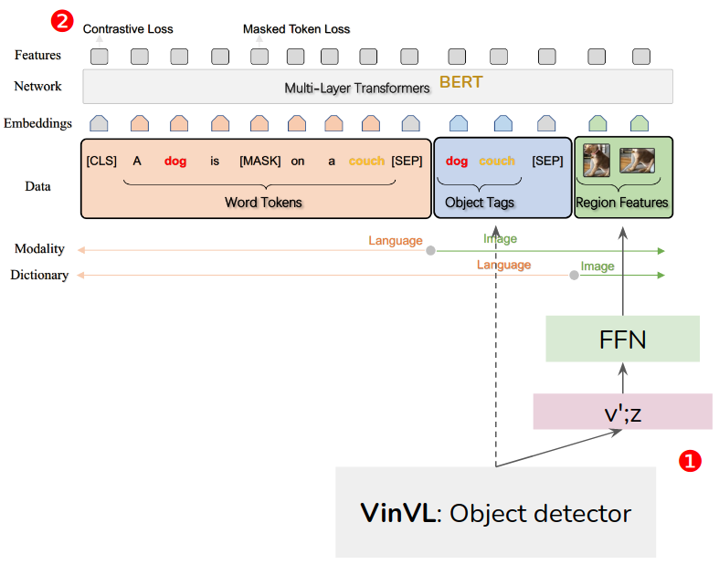 <!-- .element: class="img75" -->

----

## Oscar+ results (SoTA)

### Down-stream tasks

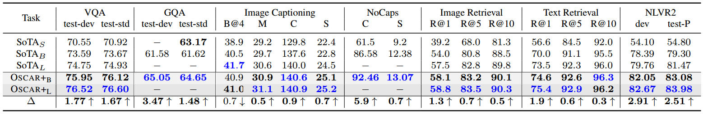 <!-- .element: class="img100" -->

### VQA 
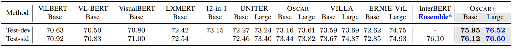 <!-- .element: class="img100" -->

VQA is from ERNIE-VIL <!-- .element: class="footnote" -->

----

## Study

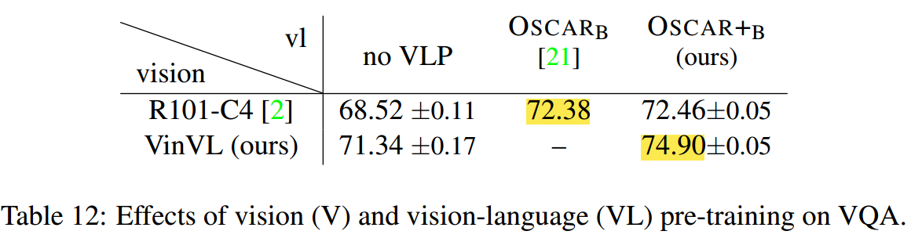 <!-- .element: class="img100" -->

- Oscar+ pre-train: **72.38** → **72.46**
- R101-C4 vs. VinVL: **72.46** → **74.90**

results from local VQA subset <!-- .element: class="footnote" -->

----

## Study

||Anderson el al. | VinVL |
|-|-|-|
|Data| VG | merged 4 datasets |
|Backbone|R101-C4| X152-C4

---

## Conclusion

### Oscar
- Use object tags as anchor point to align the image and language modalities in a shared semantic space.
-  Pre-training Oscar models on a public corpus with 6.5 million text-image pairs
- New state-of-the-arts on six established V+L tasks

----

## Conclusion

### VinVL

- New recipe to pre-train an OD model for VL tasks
- New model is bigger, and pre-trained on much larger text-image corpora
- Can generate visual features for a richer collection of visual objects and concepts that are crucial for VL tasks.
- Our results show that the new OD model can substantially uplift the SoTA results on all seven VL tasks across multiple public benchmarks.

----

## Leaderboard (test-std)

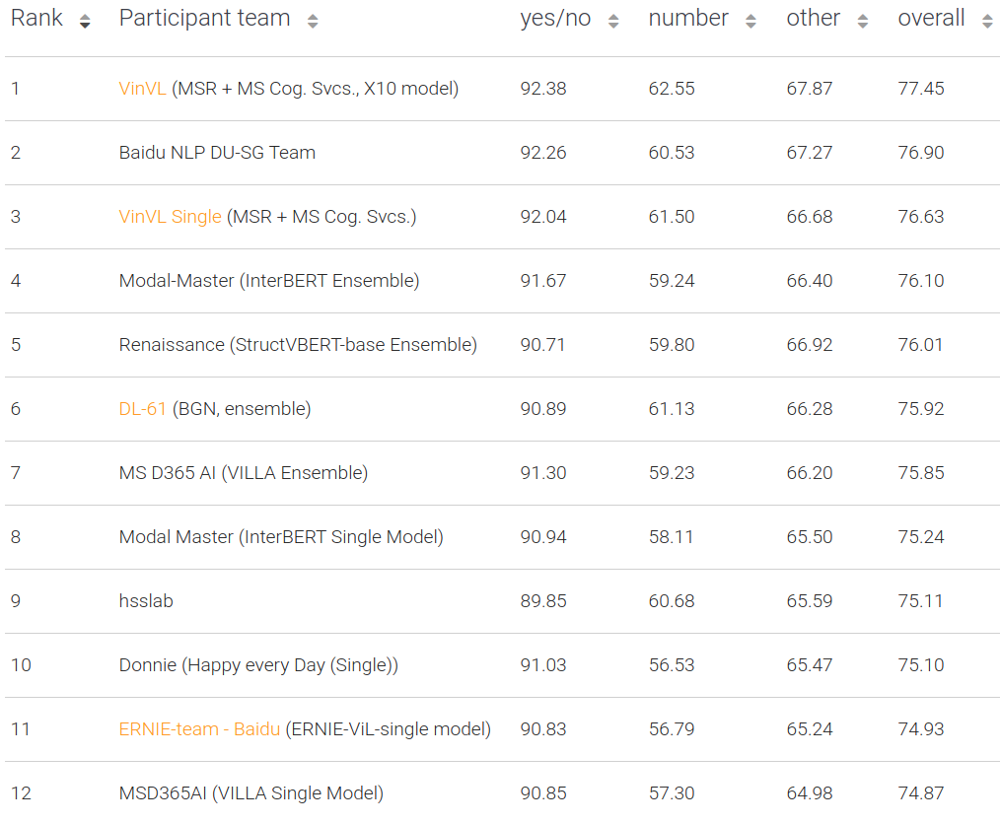 <!-- .element: class="img75" -->

---

## My work

- Run official code (fine-tune Oscar+ model on VQA)
    - 60 min / epoch
    - 25 epoch
- 下載釋出的資料集(VinVL image features)
- 評估能不能重新 Pre-train Oscar+ (?)

----

## My work

### Input region feature
若一張圖裡面有很多物件，即使有 Object tags 也很難真正的把圖片和文字 align。(沒有對應關係)

- 在 region feature 直接加一個 class embeddings
    - Learned (n_classes, 768)
- 用 OD model 的 prediction 做 weighted sum

### Predict Objective

- 將 region feature BERT 的 output 隨機換成 mask 起來 training
- 用 text & other region 預測 Mask 起來的區域是屬於哪個 class

----

## My work

 <!-- .element: class="img75" -->
